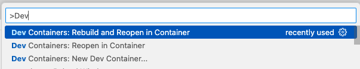

# Thinking Like A Data Scientist Repository

This repository contains tutorials and examples for data analysis and visualization using Python. The repository is set up to be used with Visual Studio Code and Dev Containers for a consistent development environment.

## Repository Structure

```text
.
├── README.md
├── data
├── requirements.txt
└── tutorials
    ├── 01_EDA
    │   └── eda_notebook.ipynb
    └── example_commands.ipynb
```

- [data/](./data/): Directory for storing datasets.
- [requirements.txt](./requirements.txt): List of Python dependencies required for the tutorials.
- [tutorials/](./tutorials/): Directory containing tutorial notebooks and scripts.
- [01_EDA/](./tutorials/01_EDA/): Directory for exploratory data analysis tutorials.
- [example_commands.ipynb](/tutorials/example_commands.ipynb): Jupyter Notebook with example commands for data generation and visualization.

## Getting Started

### Prerequisites
- [Visual Studio Code](https://code.visualstudio.com/) installed on your machine.
- [Docker](https://www.docker.com/) installed and running.
- [Dev Containers extension](https://marketplace.visualstudio.com/items?itemName=ms-vscode-remote.remote-containers) for Visual Studio Code installed.

### Setting Up the Development Environment
1. Clone the repository to your local machine:
   ```bash
   git clone https://github.com/bostdiek/TLADS.git
   cd TLADS
   ```
2. Open the repository in Visual Studio Code.
3. Open the repository in a Dev Container:
 - Press `F1` to open the command palette (or `Shift + Command + P` on Mac or `Ctrl + Shift + P` on Windows/Linux).
    - Type `Dev Containers: Rebuild and Reopen in Container` and select it.
          

### Running the Example Notebook
1. Open the ['example_commands.ipynb'](./tutorials/example_commands.ipynb) notebook in Visual Studio Code.
2. Run the cells in the notebook using the play button or by pressing `Shift + Enter`.
3. Follow the instructions in the notebook to generate and visualize data.

